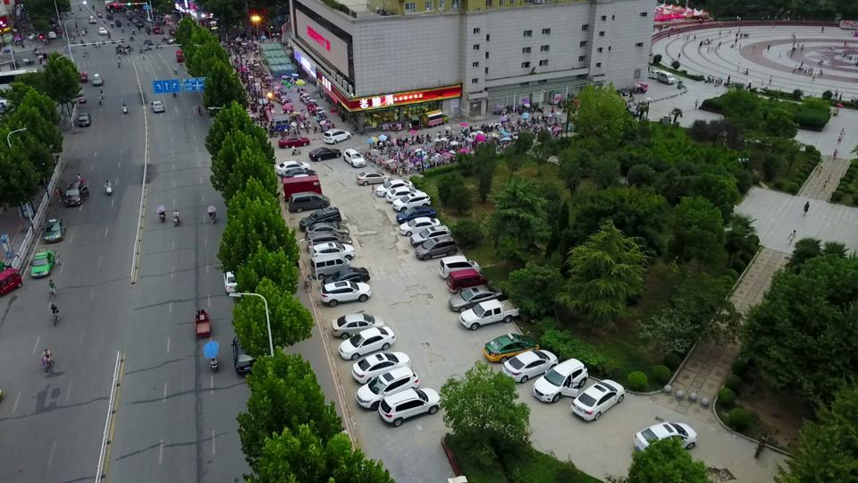
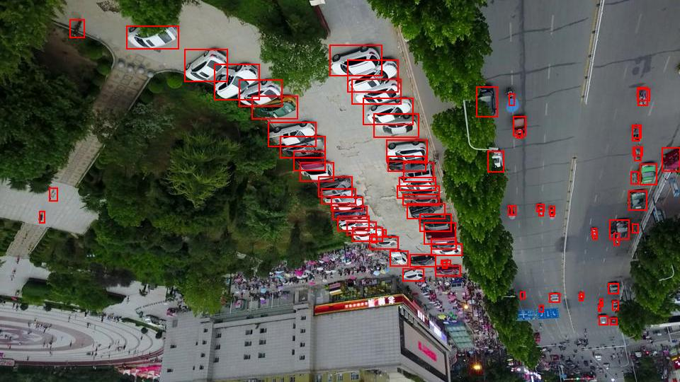
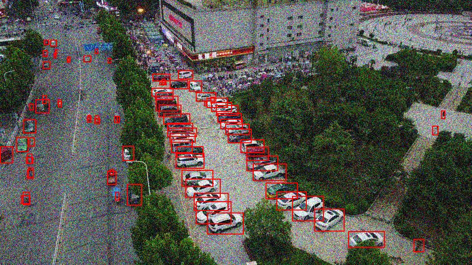

## Installation 

It is worth noticing that only Linux is supported as of now due to some of Python *os* module specifics. This may be changed later.

1. Create or initialize your Python project, then open terminal in its root directory. Do not forget to activate your
   virtual environment so system interpreter is not used to install **augmentor**.

2. Clone **augmentor** repository into your project:

   ```git clone https://gitverse.ru/sc/makarov/augmentor.git```

3. Install **augmentor** and its dependencies:

   ```pip3 install augmentor/.```

## Usage

1. Import *Augmentor* class from **augmentor** module that was installed in previous instruction. This will allow you to
   make a class object.

   ```
   from augmentor import Augmentor
   ```

2. It is mandatory to choose preferred object detection dataset format (*fmt* value, *"YOLO"* is the only supported for
   now). You can also choose to display DEBUG messages in your terminal by setting *debug* flag to True (careful though,
   as it will show augmentation status of each image in the dataset). If *log_path* is not specified, the terminal is
   used for information output. Otherwise, the logger will store it at that path which should be absolute. Summarizing,
   the class object initialization would look something like:

   ```
   augmentor = Augmentor(fmt="YOLO", debug=True, log_path="/home/user/Documents/log.txt")
   ```

3. Use *augment* method on created object. You should pass augmentation pipeline as a number of arguments - one string
   that corresponds to augmentation name (e.g. *"rotate"*) and one value that corresponds to augmentation single
   parameter (e.g. 90 for rotation augmentation). The amount of augmentations in the pipeline is not limited. You should
   also specify a number of keyword arguments - absolute *load_path*, a path to your dataset directory, absolute
   *save_path*, a path to save augmented dataset to that should be empty. You can also specify which subsets are to be
   augmented by passing keywords *train*, *val* and *test* with boolean value. They all are True by default.
   Summarizing, the augmentation method usage would look something like:

   ```
   augmentor.augment("blur", 1.2, 
                     "resize", 0.8, 
                     load_path="/home/user/Documents/VisDrone", 
                     save_path="/home/user/Documents/VisDroneAugmented", 
                     train=True, val=True, test=True)
   ```

## Augmentations

Geometric augmentations affect the image geometry and the relative position of bounding boxes. Photometric augmentations twist the image properties, like brightness, leaving its geometry and the postion of bounding boxes as is. You can observe the difference by comparing this original image to the ones under *Geometric augmentations* and *Photometric augmentations* accordingly.



Below is the list of currently supported augmentations of each type along with their corresponding values that should be passed into the pipeline as described above.

### Geometric augmentations

* Rotation: *"rotate"* and integer angle in degrees (-270, -180, -90, 90, 180 or 270)

* Flipping along axis or axes: *"flip"* and integer axis (-1 for both x and y axes, 0 for x-axis and 1 for y-axis)

* Resizing: *"resize"* and float ratio between 0.0 and 2.0

* Cropping: *"crop"* and a tuple of cropped zone (x, y, w, h) integer coordinates



### Photometric augmentations

* Saturation adjustment: *"saturation"* and a float factor that defines saturation strength between 0.0 and 2.0

* Contrast adjustment: *"contrast"* and a float factor that defines contrast strength between 0.0 and 2.0

* Brightness adjustment: *"brightness"* and a float factor that defines brightness strength between 0.0 and 2.0

* Gaussian blur: *"blur"* and a float standard deviation of the Gaussian distribution between 0.0 and 2.0

* Gaussian noise: *"noise"* and a float standard deviation of the Gaussian distribution between 0.0 and 2.0



## To be implemented

1. *COCO* and *CVAT for image* object detection dataset formats.

2. CLI and maybe some sort of minimalistic GUI.

3. Oriented bounding box augmentation.

4. Windows support.

5. Redo photometric *adjustment* methods from scratch, similarly to blur and noise.